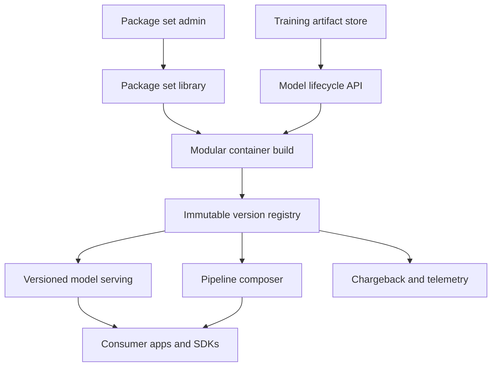

# Modulode

**Source:** `ai-in-enterprise/MLInfrastructurePart2FinalV2/`
**Domain:** `ai-enterprise`
**One-liner:** An ML platform infrastructure control plane that lets data scientists publish versioned, dependency-minimal model APIs—and keep every historical version callable—so teams stop burning 75% of their time on deployment chores.
**Wedge:** Mid-to-large enterprises with 20–200 production models where data scientists currently hand-build containers, fight dependency conflicts, and break consumer apps when they “just update” a model.
**Positioning:** ML deployment control plane. Training notebooks and generic CI/CD do not solve modular package sets, semantic versioning of config-as-change, automatic API wrapping, or multi-model pipelines. Modulode does—without forcing a monolithic mega-image.

## Market research synthesis

### Thesis from source

Algorithmia’s ML Infrastructure Part 2 (Model Deployment) argues that the core ML problem is not framework preference but **time theft and operational risk**. In a survey of **500+ data scientists**, only **25%** of time went to building and training models; **75%** went to infrastructure provisioning and deployment. Data scientists are not DevOps engineers, yet immature platforms force them into that role.

Deployment introduces challenges traditional DevOps underestimates. The paper contrasts two dependency architectures. **Monolithic automation** bundles every dependency into a mega-image: low upfront cost, but compounding size, cold starts that can worsen by **100× or more**, bandwidth/storage blowups, and eventual dependency conflicts that freeze new technology adoption behind exhaustive regression. **Modular automation** curates discrete package sets (language + framework + infra combinations) so each model loads only what it needs—higher upfront investment, but smaller containers, faster cold starts, and the ability to add new package sets without breaking backward compatibility. Algorithmia’s AI Layer is described as storing preconfigured package sets and allowing admin-defined sets while claiming **100% backward compatibility** without bulk at load time.

Beyond packaging, the control plane must expose **every capability via GUI and API** (create, upload, test, publish, call). Versioning is stricter than app software: data scientists iterate faster; models depend on external resources; non-developers can introduce breaking config changes. Therefore **every change must be versioned** (including network permissions and ownership), versioning must be **standardized and enforced** (major/minor/revision mapped to change classes such as chargeback, license, callability, environment, documentation), and **every historical version must remain callable**—because consuming applications often pin to older models for years. Last-mile accessibility requires automatic containerization, API wrap, load balancing, resource page update, and traffic cutover. Finally, standardized endpoints unlock **multi-model pipelines** (e.g., OCR → language detect → translate → tokenize → sentiment) across languages and frameworks.

The product wedge is therefore not “another model registry”—it is the **modular deployment OS** that turns package sets, immutable published endpoints, enforced versioning, and pipeline composition into the default path from trained artifact to production call.

### Buyer & economic model

- **Primary buyer:** VP of ML Platform / Head of MLOps or Director of Data Science Platform accountable for time-to-production and production reliability.
- **Users:** data scientists (publish/test), ML engineers (package sets, pipelines), platform admins (environments, permissions), application developers (call SDKs), FinOps (chargeback on versions).
- **Budget owner / value metric:** ML platform and cloud inference budget. Value metric is data-scientist productive time recovered, median time from trained artifact to published endpoint, cold-start/p95 latency, and incident rate from dependency or version breaks.
- **Competing status quo:** bespoke Dockerfiles per team, shared mega-images, ad-hoc Flask/FastAPI wrappers, and Git tags that do not version config or keep old endpoints alive.

### Domain constraints

- **Regulatory / trust / safety:** older versions may need retirement for compliance; access control and audit of who published what; model callability changes are security events.
- **Data sensitivity:** models and package sets may embed proprietary weights; logs of invocations can contain PII if callers pass raw features.
- **Change-management realities:** app teams move slower than model teams—immutable versioned endpoints are non-negotiable. Admins must be able to add frameworks without a platform rewrite.

## Business requirements

- BR-1: Data scientists must be able to publish a trained model to a versioned, callable endpoint without manually authoring infrastructure, and the system must record the time from artifact upload to publish.
- BR-2: Each deployed model must run with a curated package set limited to required dependencies—not a shared mega-image—unless an admin explicitly grants an exception.
- BR-3: Every change that can affect callers—including permissions, network access, ownership, and environment—must create a new version; silent in-place mutation of a published version is forbidden.
- BR-4: Semantic version increments must be enforced by change class (major/minor/revision) per organization policy so consumers can infer blast radius from the version alone.
- BR-5: Any non-retired historical version must remain independently callable so long-lived applications are not forced to upgrade on the model team’s schedule.
- BR-6: Publish must automatically wrap the model behind an API, update discovery metadata, and support safe traffic cutover to the new version.
- BR-7: Test invocation must be available before publish so broken models never become the default endpoint.
- BR-8: Multi-model pipelines must compose heterogeneous model endpoints under a single callable pipeline version with clear step lineage.
- BR-9: Admins must add or update package sets without breaking existing published versions’ dependency resolution.
- BR-10: Chargeback and accounting attributes must be attachable at version granularity so cost follows the model consumer, not a shared pool only.
- BR-11: All create/upload/test/publish/call operations must be available via API for CI integration and via GUI for interactive operators.
- BR-12: Retirement of a version for regulatory non-compliance must be an explicit, auditable action that blocks new calls while preserving forensic access per policy.

## User stories

Canonical user stories live in sibling [USER_STORIES.md](USER_STORIES.md).

## System design

### Overview

Modulode sits between training artifacts and consuming applications. Operators register package sets; data scientists create models, bind a package set, test, and publish immutable versions. The control plane containerizes with modular dependencies, generates an API, and keeps all non-retired versions addressable. Pipelines reference model versions as steps. CI systems drive the same lifecycle through APIs that mirror the GUI.

### Actors & boundaries

- **Actors:** data scientists, ML engineers, platform admins, app developers, FinOps, security/compliance.
- **Trust boundary:** Modulode controls packaging, endpoints, and version metadata. Training data lakes and feature stores remain upstream; secrets for private deps stay in the enterprise secret store.
- **Human-in-the-loop points:** new package-set approval; major-version publish in regulated domains; version retirement; chargeback rule changes.

### Core capabilities

1. **Package set management** — curated modular dependency environments.
2. **Model lifecycle** — create, upload, test, publish, call.
3. **Enforced versioning** — change-class → semver mapping; immutable published versions.
4. **Endpoint & SDK generation** — API wrap, discovery pages, multi-language call snippets.
5. **Historical serving** — every non-retired version independently callable.
6. **Model pipelining** — multi-step heterogeneous compositions.
7. **Access & network policy** — versioned callability and permissions.
8. **Chargeback & telemetry** — cost and latency by version.
9. **Compliance retirement** — auditable block of non-compliant versions.

### Conceptual data

- **Primary entities:** PackageSet, Model, ModelVersion, Artifact, Endpoint, InvocationTest, Pipeline, PipelineStep, AccessPolicy, ChargebackTag, RetirementRecord, SdkSnippet.
- **Critical events:** package set published, model created, version tested, version published, traffic cut over, pipeline run, version retired, permission changed (new version).
- **Retention / audit needs:** version metadata and retirement reasons retained for the life of dependent applications; invocation logs retained per PII policy with redaction options.

### Integrations (conceptual)

- **Systems of record:** model training platforms and artifact stores, source control, secret managers, API gateways, observability stacks, cloud billing.
- **Upstream signals:** trained artifacts, dependency vulnerability feeds, CI build events.
- **Downstream actions:** endpoint DNS/routing updates, consumer notifications on major versions, FinOps cost exports, security tickets on retirement.

### High-level architecture

### Success metrics

- **Leading:** median upload-to-publish time; % deploys using modular package sets vs. exceptions; test-before-publish rate; number of concurrently callable versions per model.
- **Lagging:** data-scientist time on core modeling (survey or proxy); cold-start and p95 latency vs. mega-image baseline; production incidents caused by dependency conflict or unversioned config; cost per million inferences.

## OpenAPI skeleton

Canonical HTTP surface lives in sibling [openapi.yaml](openapi.yaml). Summary:

- **Base path:** `/v1/...`
- **Auth:** `X-API-Key` for CI and runtime callers; Bearer JWT for operators.
- **Resource groups:** PackageSets, Models, Versions, Pipelines, Invocations, Admin.
