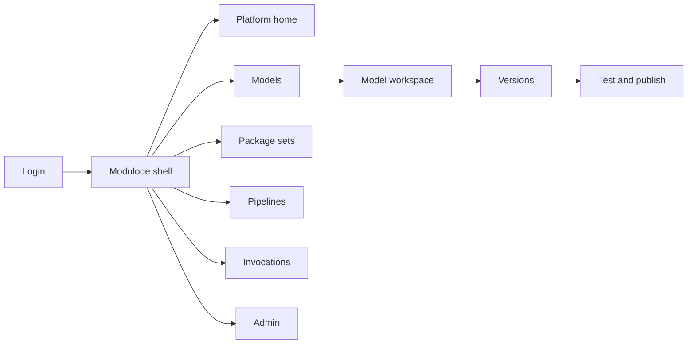
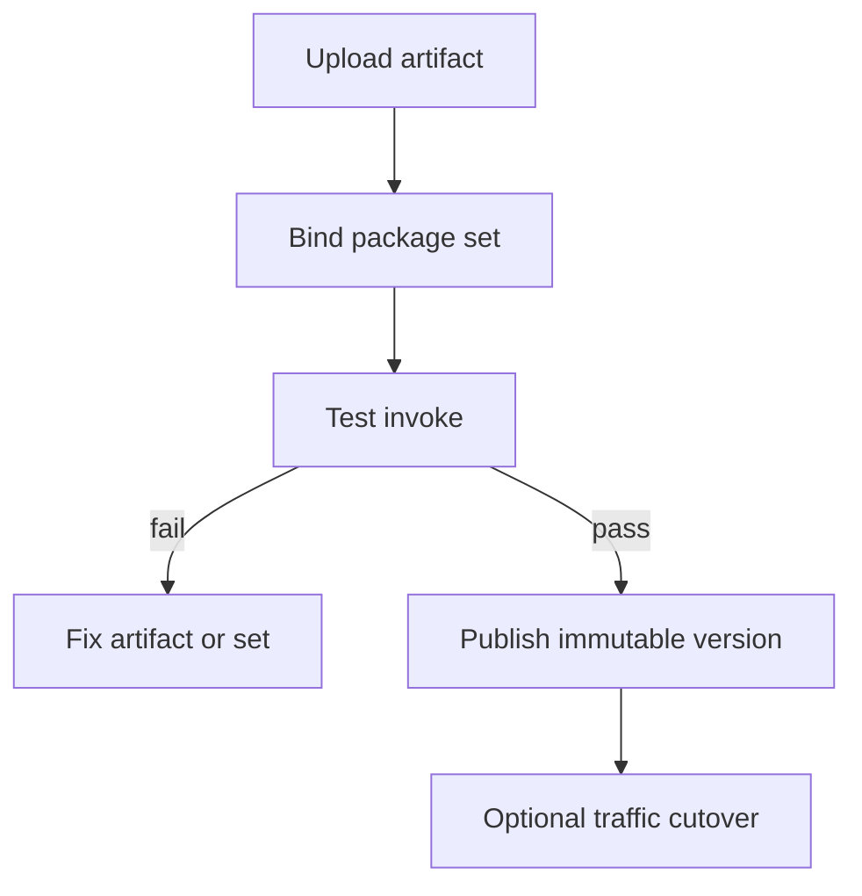

# Modulode — Web app

**Product:** [PRODUCT.md](./PRODUCT.md)
**Primary surface:** ML deployment control plane (ML platform / MLOps console)
**Secondary surfaces:** App-developer version pin & SDK snippet view; FinOps chargeback report export
**Design thesis:** Modulode is a modular shipping yard for model APIs — not a training studio. The UI metaphor is package sets and immutable berths: each published version stays callable at its own slip while new cargo (major/minor/revision) docks beside it. Visual language is dry-dock steel and signal-orange on graphite — cold-start and dependency risk feel mechanical, not magical. Mega-images are visually heavy and discouraged; slim modular sets read light. Silent in-place mutation is impossible: every permission or network tweak forces a new version badge.

## UX research synthesis

### Category peers (best-in-class)

- **Algorithmia / DataRobot MLOps deployment UIs:** Guided publish with test-before-promote. Steal: upload → package set → test invoke → publish lead-time meter (attacks the 75% infra time problem); reject hiding historical versions.
- **AWS SageMaker / Vertex AI endpoints:** Versioned endpoints and traffic split. Steal: safe cutover and discovery metadata update on publish; reject forcing a single mega-container culture.
- **Seldon / KServe dashboards:** Inference graphs and multi-model pipelines. Steal: pipeline step lineage across heterogeneous frameworks; reject ops-only YAML as the only UX.
- **Artifactory / package registry UX:** Curated dependency sets. Steal: admin-defined package sets without breaking published resolution; reject letting scientists hand-author Dockerfiles as the happy path.

### Patterns to adopt / reject

- **Adopt:** Curated package sets (anti mega-image); enforced semantic version by change class; every historical non-retired version callable; test invoke before publish; auto API wrap; pipeline composition; chargeback per version; auditable retirement; GUI≡API parity.
- **Reject:** In-place edit of published versions; shared mega-image default; Git-tag-only versioning that skips config; training notebooks as home; purple AI glow; deleting retired versions’ forensic trail.

### Trust, density, and workflow constraints from PRODUCT.md

App teams pin old versions for years (BR-5) — UI must make pins and callability obvious. Config/permission changes are version events (BR-3, BR-4). Retirement blocks new calls but keeps forensic access (BR-12). Invocation logs may contain PII — minimize in UI. Publish lead time is a product KPI (BR-1).

## Information architecture

### Nav model

### Roles → default home

| Role | Default home | Why |
|------|--------------|-----|
| Data scientist | Models — publish flow | Recover modeling time (BR-1) |
| ML platform admin | Package sets / Admin | Add sets without breaking old versions (BR-9) |
| ML engineer / pipeline owner | Pipelines | Heterogeneous step lineage (BR-8) |
| Application developer | Model version pin view | Stable SDK pins (BR-5) |
| FinOps | Chargeback report | Cost per version/consumer (BR-10) |
| Security / compliance | Retirement queue | Auditable non-compliance retire (BR-12) |

### Cross-links to OpenAPI resources

| Nav area | OpenAPI tags / resources |
|----------|---------------------------|
| Package sets | PackageSets |
| Models | Models |
| Versions / publish | Versions |
| Pipelines | Pipelines |
| Test/call | Invocations |
| Environments, permissions, chargeback | Admin |

## Screen inventory

### Platform home

- **Purpose:** Prove the 75/25 inversion is reversing: publish lead time, failed dep builds, callable version health, mega-image exceptions.
- **Entry:** Default for platform owner.
- **Layout regions:** Brand + period; lead-time trend; package-set coverage; incidents from version breaks; alerts (unpublished test fails, retirement due).
- **Primary actions:** Open slow publish; review mega-image exceptions; open retirement.
- **Empty / loading / error:** Empty = register first package set + model; loading = skeleton; error = retry with request id.
- **BR / story ties:** BR-1; FinOps platform stories.

### Model list and workspace

- **Purpose:** Create models, bind package sets, see version timeline.
- **Entry:** Nav → Models.
- **Layout regions:** Model table; workspace with artifact upload; recommended slim package set; version rail.
- **Primary actions:** Create; upload artifact; open publish flow.
- **Empty / loading / error:** No package set match = guided request to admin.
- **BR / story ties:** BR-1, BR-2.

### Package sets

- **Purpose:** Curate language/framework/infra sets; avoid mega-images; add sets without breaking published resolution.
- **Entry:** Nav → Package sets.
- **Layout regions:** Set catalog; size/cold-start hints; models using set; admin create/update; exception flag for mega-image.
- **Primary actions:** Add set; deprecate set (existing versions keep resolving); grant mega exception (audited).
- **Empty / loading / error:** Empty = seed common framework sets.
- **BR / story ties:** BR-2, BR-9.

### Version timeline

- **Purpose:** Immutable versions; change-class badges (major/minor/revision); pin status from consumers.
- **Entry:** Model → Versions.
- **Layout regions:** Timeline; change-class and reason (permissions, network, ownership, env, docs); callable vs retired; consumer pins.
- **Primary actions:** Open version; copy endpoint; compare.
- **Empty / loading / error:** Attempted in-place edit = blocked with “creates new version” CTA.
- **BR / story ties:** BR-3, BR-4, BR-5.

### Test and publish

- **Purpose:** Test invoke before publish; auto wrap API; discovery update; traffic cutover.
- **Entry:** Version draft → Publish.
- **Layout regions:** Test panel; publish checklist; lead-time clock; cutover controls; SDK snippet preview.
- **Primary actions:** Test invoke; publish; cut over traffic; rollback pointer (old versions remain).
- **Empty / loading / error:** Failed test = cannot publish (BR-7).
- **BR / story ties:** BR-6, BR-7.

### Pipelines

- **Purpose:** Compose heterogeneous model versions into a versioned pipeline (OCR→…→sentiment).
- **Entry:** Nav → Pipelines.
- **Layout regions:** Step graph; per-step model version; failure names step; pipeline versioning.
- **Primary actions:** Create pipeline; publish pipeline version; test end-to-end.
- **Empty / loading / error:** Missing step endpoint = block publish.
- **BR / story ties:** BR-8.

### Invocations and SDK

- **Purpose:** Call/test from GUI; show API parity; developer pin snippets.
- **Entry:** Nav → Invocations; developer secondary surface.
- **Layout regions:** Invoke form; response; version pin snippet; rate/error summary.
- **Primary actions:** Invoke; copy SDK; open docs.
- **Empty / loading / error:** Retired version = block new calls with forensic link.
- **BR / story ties:** BR-5, BR-11.

### Chargeback

- **Purpose:** Inference/storage cost by model version and consumer.
- **Entry:** Admin / FinOps export.
- **Layout regions:** Cost table; orphan versions; mega-image waste callouts.
- **Primary actions:** Export; attach accounting attributes to version.
- **Empty / loading / error:** Unattributed traffic = amber bucket.
- **BR / story ties:** BR-10.

### Admin: environments and permissions

- **Purpose:** Env/network/ownership changes that force version bumps; security review of callability.
- **Entry:** Nav → Admin.
- **Layout regions:** Env list; permission policies; change-class mapping policy; audit log.
- **Primary actions:** Edit policy; approve major publish in regulated mode.
- **Empty / loading / error:** Silent mutation attempts rejected.
- **BR / story ties:** BR-3, BR-4.

### Version retirement

- **Purpose:** Explicit auditable retirement — block new calls, preserve forensic access.
- **Entry:** Compliance queue; version action.
- **Layout regions:** Reason; affected consumers; block-new-calls confirm; forensic access policy.
- **Primary actions:** Retire; notify pins; export audit.
- **Empty / loading / error:** Delete forever = not offered.
- **BR / story ties:** BR-12.

## Key flows

1. **Publish without Docker** — upload artifact → select slim package set → test invoke → publish versioned endpoint; failure: test fail or mega-image without exception.

2. **Config change versions** — edit network/ownership → forced new version by change class → old remains callable (BR-3, BR-4, BR-5).

3. **Pipeline compose** — select step model versions → publish pipeline version → debug by step (BR-8).

4. **Retire non-compliant version** — reason → block calls → notify consumers → forensic retain (BR-12).

5. **Admin adds package set** — register set → new models adopt → existing versions unchanged (BR-9).

## Design system

### Tokens (CSS variables)

- `--color-ink: #E8EEF2` — text on dark
- `--color-graphite: #12161C` — app ground
- `--color-steel: #1C232D` — panels
- `--color-rule: #3A4554` — dividers
- `--color-signal: #E86F2A` — publish / cutover / attention (industrial orange, not purple)
- `--color-mint: #3DDC97` — test pass / callable healthy
- `--color-amber: #E6A23C` — mega-image exception / provisional
- `--color-coral: #E85D4C` — retired / publish block
- `--color-brand: #E86F2A` — Modulode mark
- `--font-display: "JetBrains Mono", monospace` — versions and endpoints as hero type
- `--font-body: "IBM Plex Sans", sans-serif` — chrome
- `--font-mono: "JetBrains Mono", monospace` — package set ids, hashes
- `--space-1`…`--space-8`: 4px scale
- `--radius-sm: 2px`; `--radius-md: 6px` — sharp dockyard
- `--motion-publish: 200ms ease-out` — version dock flash
- `--motion-test: 180ms ease-out` — test pass/fail
- `--motion-cutover: 260ms ease-in-out` — traffic shift
- Atmosphere: subtle blueprint grid; weight metaphors for mega vs modular; no neural imagery.

### Typography & brand

- Mono-forward for versions/endpoints (the product’s truth); Plex for forms.
- Brand in shell on every publish view; login: brand + “Publish modular model APIs — keep every version callable” + one CTA.

### Do / don’t

- **Do:** Force version on config change; keep history callable; test before publish; prefer slim package sets; show publish lead time.
- **Don’t:** In-place mutate; default mega-image; purple AI; hide retired forensic access; training-first nav.

### Accessibility & domain trust cues

- Callable/retired states use text + icon + colour.
- Live regions for publish success and retirement.
- Focus order: artifact → package set → test → publish → pin snippet.

## Component patterns

- **PackageSetPicker** — slim set recommendation with size hint.
- **SemverChangeClassBadge** — major/minor/revision from change type.
- **ImmutableVersionRail** — timeline of callable slips.
- **TestInvokePanel** — pre-publish probe.
- **PublishLeadTimeMeter** — upload→publish duration.
- **TrafficCutoverControl** — safe shift with old pins intact.
- **PipelineStepGraph** — heterogeneous model versions.
- **SdkPinSnippet** — consumer version pin copy.
- **RetirementAuditDialog** — block calls + forensic retain.
- **ChargebackByVersion** — consumer cost table.

## Out of scope for v1 web

- Model training notebooks; feature-store authoring; full cluster Kubernetes admin; public model marketplace; native mobile publish apps; replacing enterprise secret managers.
